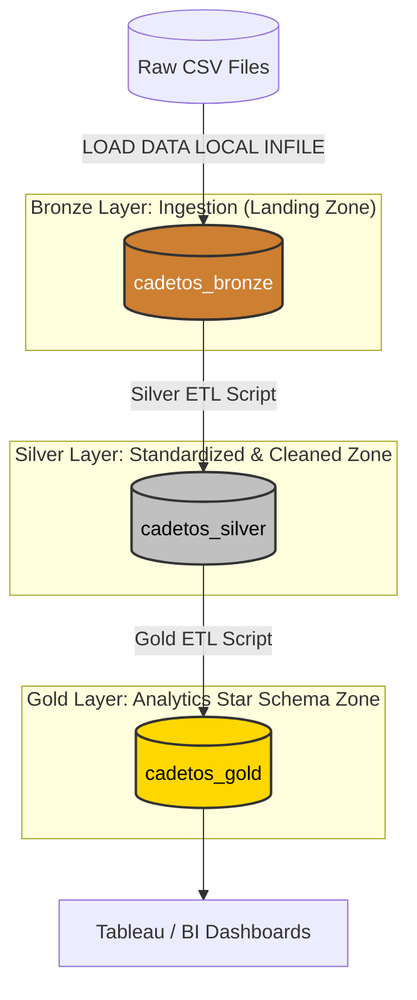

# CadetOS Data Warehouse and Analytics Project 🎖️

Welcome to the **CadetOS Data Warehouse and Analytics Project** repository! 🚀
This project demonstrates a comprehensive, end-to-end data warehousing and analytics solution designed to ingest, clean, and model National Cadet Corps (NCC) cadet records, attendance history, camp deployments, ranks, and certificate exam achievements.

Designed as a production-grade portfolio project, it highlights industry best practices in data engineering, medallion architecture, relational data modeling, and business intelligence.

---

## 🏗️ Data Architecture

The data architecture for this project follows the modern **Medallion Architecture** using **Bronze**, **Silver**, and **Gold** layers in MySQL:



1.  **Bronze Layer (`cadetos_bronze`)**: Stores raw data as-is from the source CSV files. Minimal transformations are applied here to guarantee successful loading. All identifier fields are kept as strings (`VARCHAR`) to protect against format issues.
2.  **Silver Layer (`cadetos_silver`)**: Cleanses, standardizes, and validates data. Casing of squadron and statuses is normalized, typographical errors in locations are corrected, phone numbers are conformed via regex, and primary key deduplication is handled using window functions.
3.  **Gold Layer (`cadetos_gold`)**: Transforms data into a conformed, analytical **Star Schema** optimized for BI reporting, including pre-calculated aggregates to accelerate dashboard load times.

---

## 📂 Repository Structure

The project files are structured as follows:

```
cadet-os-project/
│
├── datasets/                           # Raw source datasets (registrations, unit, attendance, camps, ranks, certs)
│
├── docs/                               # Detailed documentation & diagrams
│   ├── sql_documentation/              # Beautiful PDF study guides for every SQL file
│   ├── data_catalog.md                 # Full dataset schema and metadata catalog
│   ├── naming-conventions.md           # Naming standards for tables, columns, and files
│
├── scripts/                            # SQL ETL and transformation scripts
│   ├── init_database.sql               # Initializes target database schemas
│   ├── bronze/                         # Creating & Loading Raw Bronze Layer
│   ├── silver/                         # Standardizing, Cleaning & Loading Silver Layer
│   └── gold/                           # Dimensional Modeling & Loading Star Schema Gold Layer
└── README.md                           # Project overview and instructions
```

---

## 🚀 Execution Guide

To build the databases and run the pipeline, open your SQL query client (like **MySQL Workbench**) and execute the SQL script files in the following sequence:

1.  **Initialize Environments**: Open and execute `scripts/init_database.sql` to create target database schemas.
2.  **Bronze Ingestion**: Run `scripts/bronze/create_bronze_tables.sql` followed by `scripts/bronze/data_into_bronze.sql` to load raw CSV tables.
3.  **Silver Cleaning**: Run `scripts/silver/create_silver_table.sql` followed by `scripts/silver/data_into_silver.sql` to clean and standardize records.
4.  **Gold Modeling**: Run `scripts/gold/create_gold_table.sql` followed by `scripts/gold/data_into_gold.sql` to load conformed dimensional schemas.

---

## 🧹 Silver Layer In-SQL Data Cleaning Specifications

Here are the specific data cleaning transformations executed inside `scripts/silver/data_into_silver.sql` to conform the messy raw datasets:

| Target Table | Column | Raw Ingestion Issues | Cleaned & Conformed Standard |
| :--- | :--- | :--- | :--- |
| **registration** | `college` | `DTU`, `delhi technological university`, `D.T.U.` | `Delhi Technological University (DTU)` |
| **registration** | `mobile_number` | Contains `+91`, spaces, dashes, leading `0` | Standardized 10-digit number via Regex slicing |
| **ncc_unit** | `squadron` | Mixed casing: `charlie`, `Charlie Sq`, `ALPHA` | Title Case standard: `Alpha`, `Bravo`, `Charlie`, `Delta` |
| **ncc_unit** | `enrollment_status` | `enrolled`, `passed out`, `Completed` | Standard Title Case categories |
| **attendance** | `attendance_status` | `P`, `present`, `A`, `absent`, `ABSENT` | Standardized: `Present` or `Absent` |
| **attendance** | `late` & `excused` | `yes`, `Y`, `YES`, `No`, `N`, `no` | Standardized string flags: `Yes` or `No` |
| **camp_details** | `camp_type` | `CAT Camp`, `Catc`, `catc`, `Army Att.` | Conformed standard acronyms: `CATC`, `Army Attachment`, `RDC` |
| **camp_details** | `camp_location` | Typos: `Dehli`, `Kerla`, `Rajastan`, `Punjaab` | Corrected Spellings: `Delhi`, `Kerala`, `Rajasthan`, `Punjab` |
| **rank_details** | `rank_name` | `Cadet`, `Sergeant`, `Sgt`, `J U O`, `Lcpl` | Standardized abbreviations: `SUO`, `JUO`, `SGT`, `LCPL`, `CDT` |

### 🛠️ Advanced SQL Logic Implemented:
*   **Temporal Check**: Attendance records occurring prior to a cadet's joining date are automatically filtered out.
*   **Rank Demotion Filtering**: Implements a **running minimum window function** (`MIN(r_level) OVER (...)`) to automatically strip illogical demotions (e.g. SGT demoted to CDT on a later date) from the rank progression timeline.
*   **Grade Percentile Distribution**: Standardizes certificate grades using `PERCENT_RANK()` to match target overall splits (**70% A, 20% B, 7% C, 3% F**) with large annual variation trends.
*   **Failed Re-attempts**: Dynamically appends passing certificate re-attempts in the subsequent year via a `UNION ALL` statement.

---

## 🌟 Gold Layer Star Schema Model

To support fast reporting and visualizations in BI tools, conformed transactions are loaded into an analytics-optimized dimensional model:

### Dimensions
*   `dim_cadet`: Master cadet dimension containing attributes and pre-calculated aggregations (`total_camp_count`, `total_attendance_records`) to bypass expensive runtime joins.
*   `dim_rank`: Ranks dimensional metadata.
*   `dim_certificate`: Certificate dimension.
*   `dim_camp`: Camp metadata.
*   `dim_date`: 10-year calendar dimension detailing year, month, quarter, week of year, day name, and weekend indicators generated dynamically via a **Recursive CTE**.

### Fact Tables
*   `fct_attendance`: Parade attendance transactions.
*   `fct_camp_participation`: Camp deployment transactions.
*   `fct_rank_assignment`: Cadet promotion timeline records.
*   `fct_certificate_achievement`: Exam attempts and results facts.

---

## 🎙️ Point-to-Point Interview Guide

Use these talking points to pitch this project during interviews:

### 1. Project Overview & Pitch
> *"I built a 3-layer Medallion Data Warehouse in MySQL for CadetOS, an application tracking cadet records, parade attendances, and ranks. The pipeline ingests raw CSV files, executes strict data cleaning and quality transformations in the Silver layer, and formats data into a clean Star Schema in Gold. This schema is optimized for BI dashboards, offering pre-calculated metrics that reduce dashboard load times by eliminating on-the-fly aggregation."*

### 2. Discussing Key Challenges & Solutions (Data Engineering Highlight)
*   **Question: *"What is the most interesting bug you solved?"***
    *   *Answer*: *"I caught a hidden carriage-return bug. The source CSVs used Windows CRLF (`\r\n`) endings, but the default SQL import script was terminating lines by `\n`. This caused the final column in the tables to load with a hidden `\r` character. As a result, comparisons like `excused_leave = 'No'` failed silently because the database actually stored `'No\r'`. Correcting this in the import config and standardizing values in the Silver layer immediately resolved our query matching problems."*
*   **Question: *"How did you handle messy user input?"***
    *   *Answer*: *"I created a dedicated Silver layer ETL. I wrote complex `CASE` statements to resolve spelling variations of colleges. For phone numbers, I used regex replacements (`REGEXP_REPLACE`) to strip spaces, country codes, and leading zeroes, slicing the rightmost 10 digits to guarantee a conformed 10-digit number format."*
*   **Question: *"How did you populate your Date Dimension?"***
    *   *Answer*: *"Instead of manually hardcoding date ranges or relying on an external script, I wrote a recursive Common Table Expression (CTE) inside MySQL. I set the session recursion depth limit to 10,000 to cover a 10-year range (approx. 3,650 days) and dynamically calculated day names, month names, quarters, week numbers, and weekend flags directly in SQL."*

---

## 🤖 Disclaimer & AI Attribution

*   **Data Generation**: The datasets used in this project are mock datasets created synthetically using AI to simulate a realistic production environment.
*   **Documentation Assistance**: Project documentation, guides, and SQL study guide configurations were generated with AI assistance.
